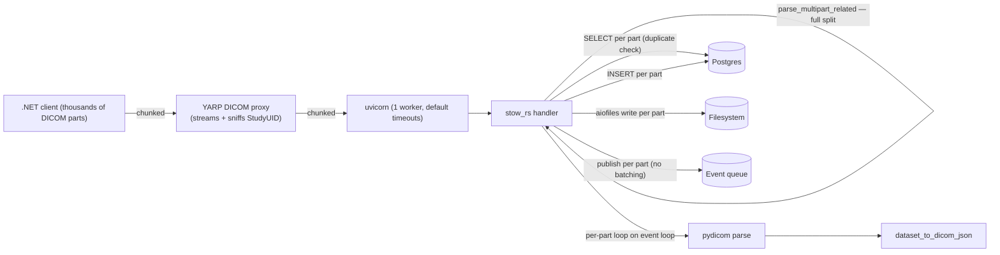

# STOW-RS Performance Review

The .NET errors (`Connection reset by peer`, `Operation canceled`, YARP `RequestTimedOut`) are classic symptoms of the upstream side **either taking too long to drain the request body, or taking too long to send response bytes back** while keep-alive expires. The current ingest pipeline has several layered amplifiers of this problem. The biggest are buffering, blocking-on-the-event-loop, and N+1 DB calls — all of which scale linearly with image count.

## Architecture today (high-level)



## Findings, ranked by impact

### 1. Whole request body is buffered before any work begins  (critical)

[app/routers/stow.py](app/routers/stow.py) lines 521 and 594:

```506:530:app/routers/stow.py
@router.post("/studies", response_class=Response, responses=_STOW_RESPONSES)
@router.post("/studies/{study_instance_uid}", response_class=Response, responses=_STOW_RESPONSES)
async def stow_rs(
    request: Request,
    study_instance_uid: Optional[str] = None,
    content_type: str = Header(...),
    db: AsyncSession = Depends(get_db),
):
    body = await request.body()
    parts = parse_multipart_related(body, content_type)

    result = await _process_stow_instances(
        parts, db, study_instance_uid=study_instance_uid, upsert=False
    )
```

- `await request.body()` reads the entire multipart payload into a single `bytes` object before anything else runs. For "several thousand images" that is multiple GB of RAM held for the lifetime of the request.
- `parse_multipart_related` then calls `body.split(boundary_bytes)` ([app/services/multipart.py](app/services/multipart.py) line 49), creating another list of byte slices, so peak memory is roughly 2× the request size.
- During this whole time the emulator is not draining anything from the socket beyond the OS receive buffer, and not sending any response. The proxy and .NET `HttpClient` see no progress, so they hit `HttpClient.Timeout` / YARP `ActivityTimeout` / Kestrel idle limits and tear down the TCP connection — exactly the "RequestTimedOut" / "Connection reset by peer" symptoms in your logs.

### 2. CPU-bound DICOM work runs on the asyncio event loop  (critical)

[app/routers/stow.py](app/routers/stow.py) lines 289–335 in `_process_stow_instances`:

```289:336:app/routers/stow.py
    for part in parts:
        try:
            ds = parse_dicom(part.data)
            ...
            dicom_json = dataset_to_dicom_json(ds)
            searchable = extract_searchable_metadata(ds)
```

- `parse_dicom` ([app/services/dicom_engine.py](app/services/dicom_engine.py) line 91) and `dataset_to_dicom_json` (line 99) are pure-Python CPU work (pydicom parse + recursive walk + base64 of binary VRs).
- Both run synchronously on the event loop. While the loop is busy parsing instance N, it is **not reading socket bytes for any other request and not sending response bytes** for the current one. With thousands of instances this stalls the loop for many seconds — long enough for keep-alive timers on the proxy / .NET side to fire.
- Combined with finding #1, the keep-alive starvation is doubled: nothing sent until the body is fully buffered AND fully parsed AND fully committed.

### 3. Single uvicorn worker  (critical)

[Dockerfile](Dockerfile) line 64:

```64:64:Dockerfile
CMD /app/.venv/bin/uvicorn main:app --host 0.0.0.0 --port 8080
```

- One Python process, one event loop. While the loop is busy with finding #2, all other requests (health checks, QIDO, change feed, even the same client's parallel STOW) wait.
- Health check failures during heavy ingest can trigger Docker / orchestrator restarts mid-request, manifesting as connection resets to the client.

### 4. N+1 SELECTs per instance  (high)

[app/routers/stow.py](app/routers/stow.py) lines 374–391 (POST path) and [app/services/upsert.py](app/services/upsert.py) lines 70–72 (PUT path):

```374:392:app/routers/stow.py
            else:
                # POST path: reject duplicates, then insert
                existing_check = await db.execute(
                    select(DicomInstance).where(DicomInstance.sop_instance_uid == sop_uid)
                )
                existing_instance = existing_check.scalar_one_or_none()
```

- One round-trip per instance just to detect duplicates. 5 000 instances ≈ 5 000 sequential SELECTs → tens of seconds even on a fast LAN.
- Same shape in `upsert_instance` for the PUT path, plus an UPDATE-style cascade in [_mark_previous_feed_entries](app/routers/_shared.py) called once per replaced instance.

### 5. One huge transaction with unbounded session growth  (high)

`_process_stow_instances` adds every `DicomInstance` and every `ChangeFeedEntry` to the session and commits once at the end (line 529 / 613).

- Identity map grows linearly; for thousands of rows the SQLAlchemy session itself becomes a memory hog.
- Locks are held for the full duration; concurrent QIDO / change-feed reads can stall.
- On a single bad part, lines 437–453 do `await db.rollback()` and **clear `result.stored` / `instances_to_publish`**, so one corrupt instance throws away thousands of successfully-parsed ones and the whole batch starts over.

### 6. Event publishing fan-out is per-instance and serialized  (high if `EVENT_PROVIDERS` set)

```458:476:app/routers/stow.py
async def _publish_stow_events(
    instances_to_publish: list[tuple],
    request: Request,
) -> None:
    service_url = str(request.base_url).rstrip("/")
    for instance, feed_entry in instances_to_publish:
        event = DicomEvent.from_instance_created(...)
        await _publish_change_event(event, instance.sop_instance_uid)
```

- `EventManager.publish_batch` already exists ([app/services/events/manager.py](app/services/events/manager.py) line 38) and `AzureStorageQueueProvider.publish_batch` is implemented ([app/services/events/providers.py](app/services/events/providers.py) line 140). The STOW path just doesn't use it.
- For Azure Storage Queue (`docker-compose.full.yml`), each publish is `await asyncio.to_thread(self.queue_client.send_message, ...)` — one thread hop and one synchronous Azurite call per instance. At ~5–20 ms each, 5 000 instances ≈ 25–100 s of post-commit latency — long after the client has given up.

### 7. Filesystem I/O scales linearly through `aiofiles`  (medium)

`store_instance` / `upsert.store_instance` do per-instance `os.makedirs` (via `to_thread`) and `aiofiles.open(...).write(...)`. Each `aiofiles` call dispatches to the default `ThreadPoolExecutor` (≤ 32 workers). Several thousand serial awaits is fine for correctness but gives no overlap between disk I/O and parsing.

### 8. SQLAlchemy pool is at defaults  (medium)

[app/database.py](app/database.py) line 17:

```9:21:app/database.py
def _make_engine():
    return create_async_engine(DATABASE_URL, echo=False, pool_pre_ping=True)
```

`pool_size=5, max_overflow=10` is the default. Under load (multiple concurrent STOW + QIDO) the pool becomes the bottleneck and requests queue waiting for a connection.

### 9. No emulator-side request timeouts / size limits  (medium)

uvicorn is launched with default timeouts. There's no `--timeout-keep-alive`, no `--limit-concurrency`, no h11 size adjustments. Combined with the .NET side likely using a shorter `HttpClient.Timeout`, mismatch causes resets exactly when the request is large.

### 10. Binary-VR base64 in `dataset_to_dicom_json`  (low/medium)

```134:155:app/services/dicom_engine.py
        elif elem.VR in ("OB", "OD", "OF", "OL", "OW", "UN"):
            ...
                encoded = base64.b64encode(raw_bytes).decode("ascii")
                entry["InlineBinary"] = encoded
```

- For modalities with embedded private/overlay binary fields (not pixel data — that one is correctly skipped), this base64-encodes blobs and embeds them in a JSONB column.
- Increases CPU on the event loop, JSON size, and Postgres write amplification.
- DICOMweb metadata responses normally use `BulkDataURI` for these, not inline base64.

## Scope of this plan

This iteration focuses on four fixes:

1. **Streaming multipart parsing** — stop buffering the whole request before any work begins.
2. **Process-pool offload of pydicom parsing + JSON conversion** — get the CPU work off the event loop and onto every available core.
3. **Fire-and-forget event publishing** — take event publishing off the STOW response path entirely so the .NET client gets the 200 immediately after `db.commit()`. Then a single batched `publish_batch` call runs in the background. Plus a small bug-level fix to `WebhookEventProvider` so it doesn't open a fresh `httpx.AsyncClient` per event.
4. **Orphan-file cleanup on partial failure** — make sure a rolled-back DB transaction doesn't leave `.dcm` files on disk that have no metadata or change-feed entry.

Smoothing of read-after-write on the consumer side is intentionally **out of scope here** and handled in the .NET webhook receiver (where it can apply a quiescing delay before posting to the ingestion queue). The emulator stays an honest dev/test mirror with no artificial enqueue delay.

The other findings (batched DB ops, multi-worker uvicorn, timeout tuning, concurrent provider fan-out, etc.) remain on the radar but are intentionally deferred — they'll be tracked as follow-ups once these land.

## Event timing today (baseline before changes)

The current per-request lifecycle is **file → DB commit → event** in that order, which is correct for "consumer can safely fetch the file as soon as the event arrives." Concretely:

1. Per part inside `_process_stow_instances` ([app/routers/stow.py](app/routers/stow.py) lines 393–419): `await store_instance(part.data, ds)` writes the `.dcm` to disk via `aiofiles`. Then `db.add(instance)` and `db.add(feed_entry)` queue rows in the SQLAlchemy session — not flushed yet.
2. After the loop ([app/routers/stow.py](app/routers/stow.py) line 529): `await db.commit()` — single transaction, autoincrements assigned, change-feed sequence numbers materialized.
3. Only on commit success ([app/routers/stow.py](app/routers/stow.py) line 534): `_publish_stow_events` iterates `instances_to_publish` and `await`s **one publish per instance, serially**, with `event_time` stamped at publish time.

This produces three real problems for high-load STOW:

- **No streaming events.** A 5 000-image batch produces zero events for ~1 minute, then 5 000 events queued sequentially, all timestamped after commit.
- **Dominant tail latency.** With Azure Storage Queue at ~5–20 ms per send, 5 000 instances ≈ 25–100 s of post-commit wall time during which the .NET HTTP client is still waiting for the response. This very plausibly contributes to the timeouts you're seeing.
- **Orphan files on partial rollback.** [app/routers/stow.py](app/routers/stow.py) lines 437–453 catches a per-part exception, calls `db.rollback()`, and clears `instances_to_publish` — but `store_instance` already wrote `.dcm` files for the prior parts in the loop. They're left on disk with no DB row and no event. Same shape on a final-commit failure.

## Target architecture

```mermaid
flowchart LR
    NET[".NET client"]
    Proxy["YARP DICOM proxy"]
    UV["uvicorn worker"]
    Stow["stow_rs handler"]
    Parser["streaming multipart parser<br/>(async generator)"]
    PPX[ProcessPoolExecutor]
    W1["worker process 1<br/>parse_dicom + to_json"]
    W2["worker process 2<br/>parse_dicom + to_json"]
    Wn["worker process N"]
    PG[(Postgres)]
    FS[(Filesystem)]

    NET -->|chunked| Proxy -->|chunked| UV --> Stow
    Stow -->|"async for part in stream(req)"| Parser
    Parser -->|bytes| Stow
    Stow -->|run_in_executor"(parse_bytes_to_record)"| PPX
    PPX --> W1
    PPX --> W2
    PPX --> Wn
    W1 -->|picklable record| Stow
    W2 -->|picklable record| Stow
    Wn -->|picklable record| Stow
    Stow --> PG
    Stow --> FS
```

## Design

### Streaming multipart parser

New module: replace [app/services/multipart.py](app/services/multipart.py) `parse_multipart_related` with an async generator function (kept as `parse_multipart_related` for callers that still need it, plus a new `iter_multipart_related`).

```python
async def iter_multipart_related(
    request: Request, content_type: str
) -> AsyncIterator[MultipartPart]:
    boundary = _extract_boundary(content_type)  # existing logic
    delimiter = b"\r\n--" + boundary.encode()
    buf = bytearray()
    started = False
    async for chunk in request.stream():
        buf.extend(chunk)
        while True:
            part, consumed = _try_extract_one_part(buf, delimiter, started)
            if part is None:
                break
            del buf[:consumed]
            started = True
            if part is _CLOSING_BOUNDARY:
                return
            yield part
```

Implementation notes:
- Rolling-buffer scanner; only retains the bytes for the **current** in-flight part, so peak memory ≈ size of one DICOM instance, not the whole request.
- Parses headers per part (just `Content-Type`); skips non-DICOM parts with the same rule the existing parser uses.
- Keep the existing `parse_multipart_related(body, content_type)` as a thin wrapper that wraps a `bytes` into a fake stream — preserves test compatibility.

### ProcessPoolExecutor for parse + JSON

New module `app/services/dicom_parse_worker.py` with a **top-level, picklable** function (top-level is required for `multiprocessing` pickling):

```python
def parse_part_to_record(data: bytes) -> ParsedPartRecord:
    """Runs in a worker process. Returns only picklable data."""
    ds = pydicom.dcmread(BytesIO(data), force=True)
    errors = validate_required_attributes(ds)
    warnings = validate_searchable_attributes(ds) if not errors else []
    if errors:
        return ParsedPartRecord(ok=False, errors=errors, ...)
    return ParsedPartRecord(
        ok=True,
        sop_class_uid=str(getattr(ds, "SOPClassUID", "")),
        study_uid=str(ds.StudyInstanceUID),
        series_uid=str(ds.SeriesInstanceUID),
        sop_uid=str(ds.SOPInstanceUID),
        transfer_syntax_uid=...,
        dicom_json=dataset_to_dicom_json(ds),
        searchable=extract_searchable_metadata(ds),
        warnings=warnings,
    )
```

`ParsedPartRecord` is a `@dataclass(slots=True)` of plain types only (str / int / dict / list) so pickling is cheap. Crucially, **`pydicom.Dataset` is not crossed across the process boundary** — it stays in the worker; only the digested record comes back.

Lifecycle in [main.py](main.py):

```python
# in lifespan()
import os
from concurrent.futures import ProcessPoolExecutor
import multiprocessing as mp

ctx = mp.get_context("spawn")  # avoid fork+asyncio pitfalls; portable
app.state.parse_pool = ProcessPoolExecutor(
    max_workers=int(os.getenv("DICOM_PARSE_WORKERS", os.cpu_count() or 2)),
    mp_context=ctx,
)
try:
    yield
finally:
    app.state.parse_pool.shutdown(cancel_futures=True)
```

New env knobs in [app/config.py](app/config.py):
- `DICOM_PARSE_WORKERS` (default `os.cpu_count()`)
- `DICOM_PARSE_INFLIGHT` (default `2 × DICOM_PARSE_WORKERS`) — how many parts can be in flight concurrently from a single STOW request, used as an `asyncio.Semaphore` to bound memory.

### Wiring in `stow_rs` / `stow_rs_put`

```python
async def stow_rs(request: Request, ..., db: AsyncSession = Depends(get_db)):
    pool: ProcessPoolExecutor = request.app.state.parse_pool
    sem = asyncio.Semaphore(DICOM_PARSE_INFLIGHT)
    loop = asyncio.get_running_loop()
    written_files: list[Path] = []  # for rollback cleanup

    async def parse_one(data: bytes) -> ParsedPartRecord:
        async with sem:
            return await loop.run_in_executor(pool, parse_part_to_record, data)

    pending: list[asyncio.Task[ParsedPartRecord]] = []
    async for part in iter_multipart_related(request, content_type):
        pending.append(asyncio.create_task(parse_one(part.data)))

    records = await asyncio.gather(*pending)
    result = await _persist_records(
        records, db, study_instance_uid, upsert=False,
        written_files=written_files,
    )
    ...
```

`_persist_records` is the new home for the post-parse work currently inlined in `_process_stow_instances` (validation has already happened in the worker; here we only do duplicate detection, file writes, and DB inserts). The session-touching code stays on the main asyncio thread — the executor is **only** for parse + JSON conversion. `written_files` is a shared list that `_persist_records` appends to on every successful disk write so the orchestrator can roll the filesystem back if the DB commit fails (see "Orphan-file cleanup" below).

### Event publishing — fire-and-forget + batched call + webhook hygiene

Three changes, in order of impact:

1. **Take event publishing off the response path.** Replace the synchronous `await _publish_stow_events(...)` after `db.commit()` ([app/routers/stow.py](app/routers/stow.py) line 534, mirrored at line 618 for PUT) with a tracked background task. STOW returns the HTTP 200 to the proxy as soon as the DB transaction commits.

   ```python
   # at module level
   _pending_event_tasks: set[asyncio.Task[None]] = set()

   def _spawn_publish(events: list[DicomEvent]) -> None:
       if not events:
           return
       task = asyncio.create_task(_publish_stow_events(events))
       _pending_event_tasks.add(task)
       task.add_done_callback(_pending_event_tasks.discard)
   ```

   In `lifespan()` shutdown ([main.py](main.py)) drain pending tasks with a bounded wait so a graceful container stop still flushes outstanding events:

   ```python
   if _pending_event_tasks:
       await asyncio.wait(
           _pending_event_tasks,
           timeout=float(os.getenv("EVENT_DRAIN_TIMEOUT_SECONDS", "30")),
       )
   ```

   Trade-off you should know about: a *hard* kill (SIGKILL, OOM, crashed container) between commit and the publish completing means those events are lost. The change-feed table itself is part of the commit and survives — a downstream consumer can backfill via `GET /v2/changefeed?startTime=...`. This is *not a regression* relative to today (events are already best-effort with errors swallowed), but the loss window moves from "during the in-line publish" to "during the background publish."

2. **Single `publish_batch` call inside the background task.** Inside `_publish_stow_events`, build the full list once and call `event_manager.publish_batch(events)` instead of looping per-instance. `EventManager.publish_batch` ([app/services/events/manager.py](app/services/events/manager.py) line 38) already exists and forwards to each provider's `publish_batch`.

   ```python
   async def _publish_stow_events(
       instances_to_publish: list[tuple],
       service_url: str,
   ) -> None:
       events = [
           DicomEvent.from_instance_created(
               study_uid=inst.study_instance_uid,
               series_uid=inst.series_instance_uid,
               instance_uid=inst.sop_instance_uid,
               sequence_number=fe.sequence,
               service_url=service_url,
           )
           for inst, fe in instances_to_publish
       ]
       if events:
           try:
               await get_event_manager().publish_batch(events)
           except Exception as e:
               logger.error("Batch event publish failed: %s", e)
   ```

   Note we precompute `service_url` from `request.base_url` *before* spawning the task — `request` itself shouldn't be captured by a background task whose lifetime outlives the request.

3. **WebhookEventProvider: reuse one `httpx.AsyncClient` per batch.** Today's `publish_batch` ([app/services/events/providers.py](app/services/events/providers.py) lines 123–126) calls `_send_webhook` per event, and `_send_webhook` constructs a fresh `async with httpx.AsyncClient()` (lines 113–115) — so N events = N TLS handshakes. Refactor so the client is created once at the batch level and reused via HTTP keep-alive:

   ```python
   async def publish_batch(self, events):
       async with httpx.AsyncClient(timeout=5.0) as client:
           for event in events:
               @retry(stop=stop_after_attempt(self.retry_attempts),
                      wait=wait_exponential(multiplier=1, min=1, max=10),
                      retry=retry_if_exception_type(httpx.HTTPError),
                      reraise=True)
               async def _do_send():
                   r = await client.post(self.url, json=event.to_dict())
                   r.raise_for_status()
               await _do_send()
   ```

   This is purely a hygiene fix — it's wasteful regardless of whether events are on the critical path. `AzureStorageQueueProvider.publish_batch` and `FileEventProvider.publish_batch` are left as-is (their current serial loops are already off the response path; if they become a bottleneck inside the background task we can add bounded `gather` later).

Net effect: STOW response returns to the proxy immediately after `db.commit()`. The .NET ingestion side controls its own quiescing window between webhook receipt and queue enqueue, so the emulator never has to think about read-after-write contention.

### Orphan-file cleanup on partial / commit failure

Two failure paths today leak files:

1. **Per-part exception** in `_process_stow_instances` ([app/routers/stow.py](app/routers/stow.py) lines 437–453) — `db.rollback()` undoes pending DB writes for prior parts in the batch, but the `.dcm` files those parts already wrote stay on disk.
2. **Final commit failure** in `stow_rs` ([app/routers/stow.py](app/routers/stow.py) lines 528–532) — same shape, larger blast radius.

Fix:

- Thread a `written_files: list[Path]` list down through `_persist_records` (and the equivalent helper for the PUT/upsert path).
- After every successful `await store_instance(...)`, append the returned path.
- On a per-part exception: unlink files this loop iteration created (typically just one — the one whose write succeeded but whose DB add raised). Don't unlink prior parts' files; their DB rows are also rolled back, so we unlink **everything in `written_files`** when we choose this strategy. Keep the existing "skip and continue" semantics by clearing `written_files` together with `result.stored` / `result.instances_to_publish` so the next part starts fresh.
- On final commit failure: unlink everything in `written_files` before re-raising.
- All unlinks via `await asyncio.to_thread(os.unlink, path)` with `try/except FileNotFoundError` (defensive).
- Best-effort directory cleanup (the existing `_try_rmdir` helper in [app/services/upsert.py](app/services/upsert.py) is reusable).

This restores the invariant: **a `.dcm` file on disk implies a committed DB row exists**, which is what every consumer of the change feed assumes.

### Cross-cutting concerns

- **Tests**: `tests/` exercises both the parser ([app/services/multipart.py](app/services/multipart.py)) and STOW routes. Add cases for: chunked stream with split boundary across chunks; very small chunks; closing boundary; non-DICOM parts mixed in. For the executor, expose a way to run synchronously (`DICOM_PARSE_WORKERS=0` → `await loop.run_in_executor(None, ...)`) so unit tests don't have to spin up subprocesses.
- **Backwards compatibility**: existing `parse_multipart_related(body, content_type) -> list[MultipartPart]` stays callable for tests and the `bulk_update_studies` flow.
- **Error handling**: a worker-side exception surfaces as `BrokenProcessPool` only for catastrophic failures; per-part Python exceptions are caught inside `parse_part_to_record` and returned as `ok=False` records, so the request loop never crashes mid-batch.
- **`spawn` startup cost**: `spawn` workers re-import the app on first task. Mitigate by importing `parse_part_to_record`'s module only (no FastAPI), and by warming the pool at lifespan startup with one no-op submit per worker.

## Out of scope (tracked for later)

These remain valid and were promoted from the original review; not addressed in this iteration:

- N+1 duplicate-check SELECTs and bulk Core inserts ([app/routers/stow.py](app/routers/stow.py) lines 374–391, [app/services/upsert.py](app/services/upsert.py) lines 70–72).
- Multi-worker uvicorn + timeout/limit tuning in [Dockerfile](Dockerfile) / [docker-compose.yml](docker-compose.yml).
- Drop the all-or-nothing rollback approach in [app/routers/stow.py](app/routers/stow.py) lines 437–453 in favour of true per-part partial success (requires bulk-insert from above to be safe; orphan-file cleanup in this iteration is a strict improvement on what's there now but doesn't fully fix the semantics).
- SQLAlchemy pool sizing in [app/database.py](app/database.py).
- Inline base64 of binary VRs in [app/services/dicom_engine.py](app/services/dicom_engine.py) → `BulkDataURI`.
- Same batching applied to `bulk_update_studies`.
- `pytest-benchmark` STOW regression test.
- Outbox / replay pattern for guaranteed event delivery (today, and after this iteration, a hard process kill between commit and background-task completion still loses the unfired events; consumers can backfill via change-feed).
- Bounded-concurrency `asyncio.gather` inside `AzureStorageQueueProvider.publish_batch`. Now that publishing is off the response path it's no longer urgent; revisit if background-task latency becomes an issue.
- Enqueue-time visibility delay on event publishing — intentionally kept in the .NET webhook receiver instead of the emulator, so the emulator stays an honest dev/test mirror.
